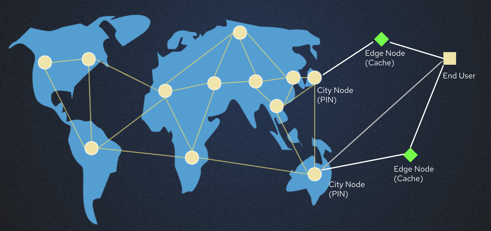

**IPDN: Pioneering the Decentralized Hot Data Storage and Content Delivery Network**

*Introduction*

With the dawn of the digital age, data has become the lifeblood of our contemporary world. The need for efficient data storage and distribution has never been more pronounced, and decentralized data storage solutions are garnering the attention of a growing number of investors and innovators. In this arena, a multitude of participants have entered the fray, including Filecoin, IPFS, Arweave, Storj, and others. However, they still fall short of fully meeting the demands of certain developers for instantaneous access to hot data storage and accelerated content delivery. This article delves into the IPDN project, encompassing a project overview, key features, use cases, a comparative analysis with competitors, and market prospects. The objective is to provide a more in-depth understanding for developers and various stakeholders interested in the project.

**Part One: An Overview of the IPDN Project**

*Project Background*

The concept behind the IPDN(Interplanetary Data Network) project draws inspiration from the Filecoin project, the IPFS project, and the practical needs of dApp developers. Building on our team's prior experience and insights, we have recognized that existing decentralized storage products fall short of fully satisfying developers' requirements. For example, Nowhere, a decentralized short video sharing app, demands high real-time access for streaming content and data, while mainstream decentralized storage projects struggle to deliver such high-performance capabilities. Moreover, traditional centralized data storage methods face a plethora of challenges, including single points of failure, data loss, data tampering, data ownership monopolies, and more. This has fueled the emergence of decentralized data storage solutions, which aim to fulfill the heightened demand for data availability and security while restoring data sovereignty to users.

*Introducing IPDN*

IPDN is a decentralized hot data instant access and content delivery network. Its core mission is to provide efficient, secure, scalable, and user-friendly data storage and content transmission services. The architectural foundation of this project comprises city nodes and edge nodes, offering developers and users a novel data storage and distribution solution.

**1.1 Key Features**

IPDN's key features encompass:

*Decentralized CDN*: IPDN delivers services akin to traditional Content Delivery Networks (CDNs), but with decentralized attributes. This implies data can be transmitted more swiftly to users across the globe while reducing bandwidth costs.

*Streaming and Streaming Acceleration*: IPDN offers distributed streaming and streaming acceleration, lowering entry barriers and costs for users compared to centralized alternatives.

*Hot Data Storage*: City nodes represent the heart of IPDN, responsible for storing and pinning user data. This guarantees data persistence, enabling users to access their data at any time without the fear of data loss.

*Incentive Mechanisms*: To attract node participation within the network, IPDN employs an innovative incentive mechanism. Both city nodes and edge nodes can earn token rewards through network participation, effectively preserving user data. City nodes receive rewards for data storage and provisioning storage services, while edge nodes receive rewards to offset their bandwidth costs.

*Proof-of-Storage and Proof-of-Retrieve*: To verify data integrity and security, IPDN employs storage proof and retrieval proof mechanisms. These ensure that nodes are genuinely storing data and that users can securely and completely retrieve their data.

*Proof-of-Location*: For the DePIN service, it is crucial that nodes are geographically dispersed to enhance the user experience. IPDN employs Proof-of-Location to mandate city nodes to submit location proofs to the network. The IPDN network restricts the number of city nodes in different regions based on actual user and data volume to prevent node centralization and ensure a healthy incentive network, avoiding malicious competition.

**Part Two: Highlights and Use Cases of IPDN**

*Hot Data Storage and Content Distribution*

One of the standout features of IPDN is its capability to deliver fast, scalable hot data storage and content distribution services. This is pivotal for websites, applications, and streaming services. Users can anticipate low latency, high availability, and global distribution, elevating their overall experience.

*Data Security and Integrity*

IPDN ensures data security and integrity through storage proof, random challenge, retrieval proof, and token staking mechanisms. Every node must generate storage proof to validate the existence and integrity of the data. Additionally, data can be encrypted to enhance security.

*Incentive Mechanisms*

One of the highlights of IPDN is its incentive mechanism. It encourages city nodes and edge nodes to actively participate in the network and maintain user data. City nodes can earn rewards through storage proofs, while edge nodes receive rewards to offset their bandwidth costs.

**Part Three: Comparative Analysis with Competitors**

*Comparison with Filecoin*

In contrast to Filecoin, IPDN places a stronger emphasis on hot data storage. Filecoin, on the other hand, is oriented more toward long-term storage. IPDN provides faster data retrieval and lower latency, making it suitable for applications that necessitate rapid access, such as CDNs.

*Comparison with IPFS*

IPDN significantly differs from IPFS. While IPFS enjoys widespread adoption, it lacks an incentive layer. Though IPFS has Pin Service Providers, it sacrifices decentralization. IPFS and IPDN cater to distinct use cases.

*Comparison with Arweave*

Arweave primarily concentrates on the permanent storage of data (with storage periods lasting a minimum of 200 years). However, the associated storage costs are notably high, limiting its potential use cases. Arweave excels at storing specific data related to human civilization, such as Wikipedia.

*Comparison with Storj*

Compared to Storj, IPDN offers a more comprehensive hot data storage and content transmission service. Storj competes with S3 and provides a more generalized storage solution. IPDN, in contrast, centers more on hot data storage. Additionally, network architecture, incentive mechanisms, and application domains differ.

**Part Four: Market Outlook for IPDN**

*Potential Use Cases*

IPDN harbors potential applications across various domains. It can be employed to accelerate websites, applications, streaming services, and data backups, ensuring data security and availability. Furthermore, IPDN has the potential to support video streaming CDN services and RTMP streaming.

*Market Analysis*

IPDN occupies a favorable position in the decentralized data storage market. The market is fiercely competitive, but IPDN's unique characteristics and potential set it on a promising trajectory for future success.

**Conclusion**

The IPDN project represents not only a decentralized hot data storage and content delivery network but also incorporates Compute-over-Data features in the future. Developers and investors should closely monitor the development of IPDN, as it holds the potential to become a pivotal platform for decentralized hot data storage and content delivery in the future.
